# code-to-docx

A simple tool to automatically compile your source code and output screenshots into a single Word document.  
Perfect for creating assignment reports, documentation, or submissions with minimal effort.

## Notes

- Previous repo name was Code_n_Output_to_docx
- All folder names have been changed to lowercase (small casing) for consistency. If you are upgrading or cloning, please use the new lowercase folder structure.

## ✨ Features

- Combine source code and corresponding output images into a `.docx` file.
- Supports multiple programming languages (as long as all files are of the same type).
- Option to generate a document **with or without code**.
- Easy folder-based organization.

---

## 📦 Requirements

- **Python** 3.7 or 3.8
- **python-docx** module

Install dependency:

```bash
pip install python-docx
```

---

## 🚀 Usage (Step by Step with Screenshots)

### 1. Clone the repository

```bash
git clone https://github.com/aadityaprabu/code-to-docx.git
cd code-to-docx
```

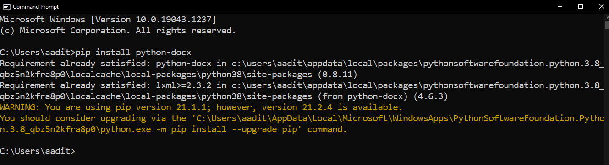

---

### 2. Open the source code

Open the project in **IDLE** or your favorite editor.  
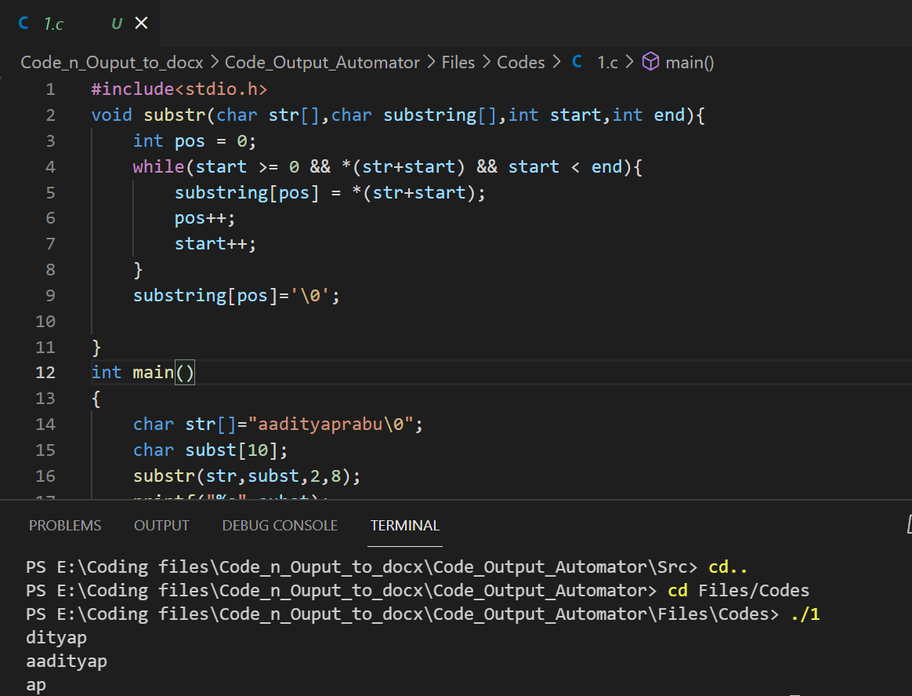

---

### 3. Add your code files

- Place your code files inside `files/codes/`
- Example: `1.c`, `2.c`, `3.c` … (any extension works, just keep them ordered and of the same type).

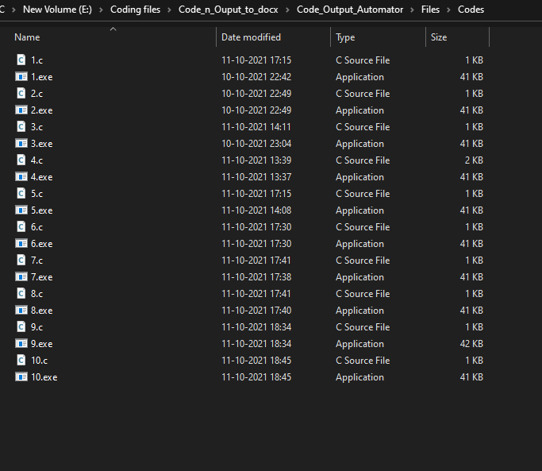

---

### 4. Add your output images

- Place your output screenshots inside `files/images/`
- Example: `1.png`, `2.png`, `3.png` … (all images should be the same type).

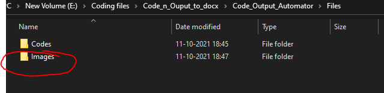  


---

### 5. Run the script

Locate and run the script:

```bash
python automator.py
```

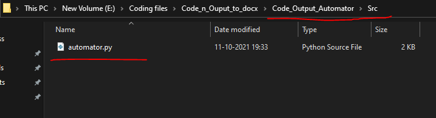  
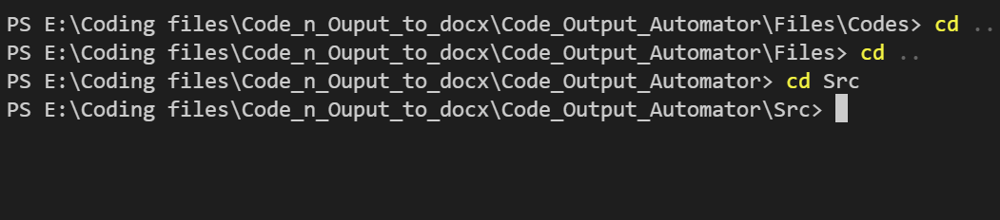

---

### 6. Get your Word document

- After running, check the `documents/` folder.
- You’ll find the compiled `computer-science-assignment.docx` file there.

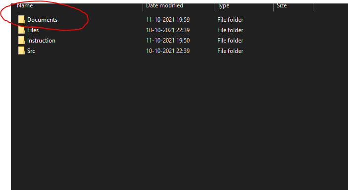  
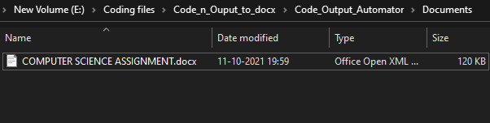  
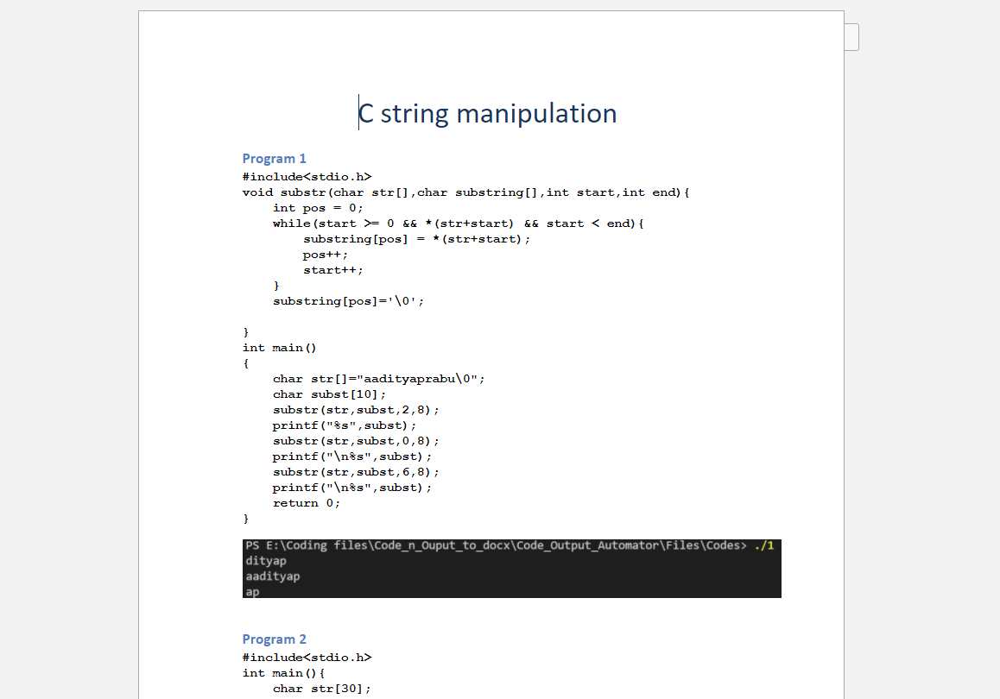  
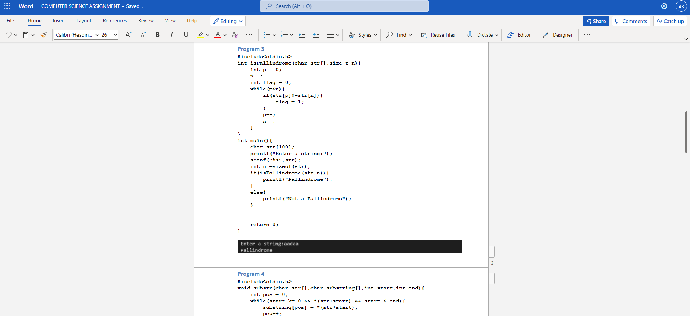

---

## 📷 Example File Structure

```
files/
 ├── codes/
 │   ├── 1.c
 │   ├── 2.c
 │   └── 3.c
 └── images/
     ├── 1.png
     ├── 2.png
     └── 3.png
```

Output in `documents/`:

```
computer-science-assignment.docx
```

---

## 📝 Sample Output

If everything runs correctly, your output Word file will look like this:


---

## 🤝 Contributing

Pull requests are welcome! For major changes, please open an issue first to discuss what you’d like to improve.

---

---

## 📰 This has been published to cache IT Ceg Magazine

See it here: [cache IT Ceg Magazine](https://publications.istaceg.in/?tab=publications#:~:text=2021)

Images from the publication:

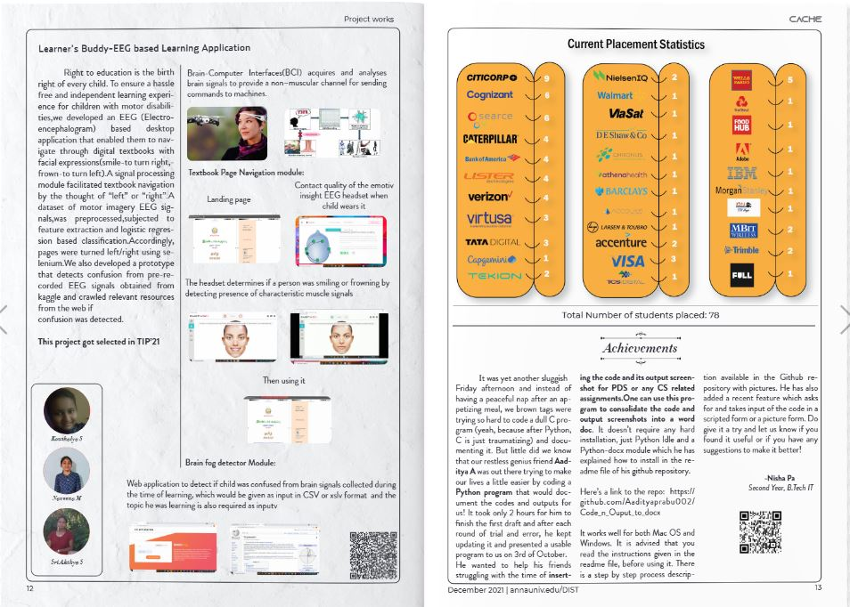
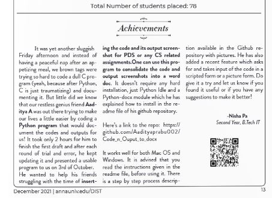

---

## 📜 License

This project is licensed under the [MIT License](LICENSE).
